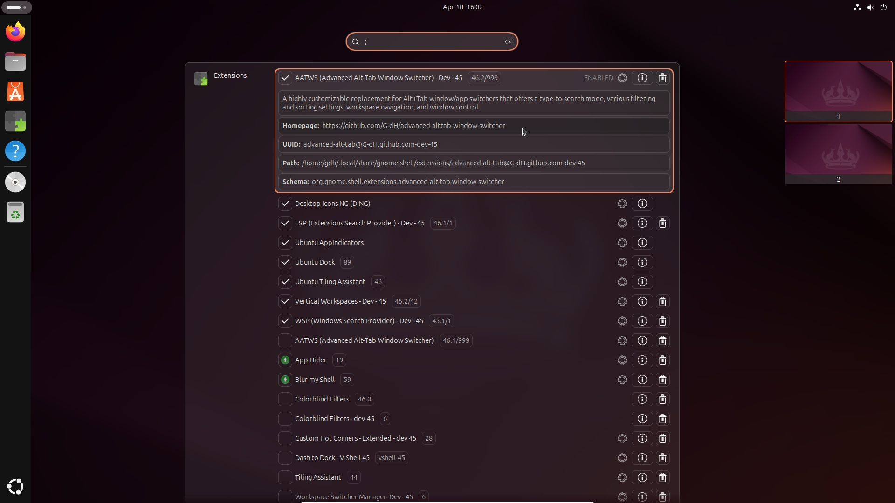

# ESP (Extensions Search Provider)
A GNOME Shell extension that gives you access to extensions Settings through overview search.

This extensions has been originally crated as a module for V-Shell extension.

### Supported GNOME Shell versions
42 - 46

[](https://extensions.gnome.org/extension/6721)



## How to use ESP
1.  Open the overview (press and release the Super key or trigger the hot corner)
2.  a) Type the name of the extension you are looking for; results will be added to the global search<br>
    b) Type `eq//`, `qqe` or ``` ` ```/`;`/`|` (usually the key above Tab) to list all installed extensions. You can continue typing the name of an extension to filter the list<br>
    a,b) Type `enabled` to filter the results and display only the enabled extensions (note: it also includes extensions with this word in their names)<br>
    Extensions without *Settings* appear with dimmed names<br>
3.  a) Activate the search result to open extension's *Settings* window (if available)<br>
    b) Click on the status icon to toggle the extension state between enabled and disabled (or select the result using the keyboard and activate it while holding the *Shift* key)

## Installation
### Installation from extensions.gnome.org
The easiest way to install ESP: go to [extensions.gnome.org](https://extensions.gnome.org/extension/6721) and toggle the switch. This installation also gives you automatic updates in the future.

### Installation from GitHub repository
You may need to install `git`, `make`, `gettext` and `glib2.0` for successful installation.
Navigate to the directory you want to download the source code and execute following commands in the terminal:

#### GNOME 45+

    git clone https://github.com/G-dH/extensions-search-provider.git
    cd extensions-search-provider
    make install

#### GNOME 42-44

    git clone https://github.com/G-dH/extensions-search-provider.git
    cd extensions-search-provider
    git checkout gnome-42-44
    make install

#### Enabling the extension
After installation from the repository, you need to enable the extension.

- First restart GNOME Shell (`ALt` + `F2`, `r`, `Enter`, or Log-Out/Log-In if you use Wayland)
- Now you should see the *ESP (Extensions Search Provider)* extension in the *Extensions* application (reopen the app if needed to load new data), where you can enable it.

## Buy me a coffee
If you like my extensions and want to keep me motivated give me some useful feedback, but you can also help me with my coffee expenses:
[buymeacoffee.com/georgdh](https://buymeacoffee.com/georgdh)
